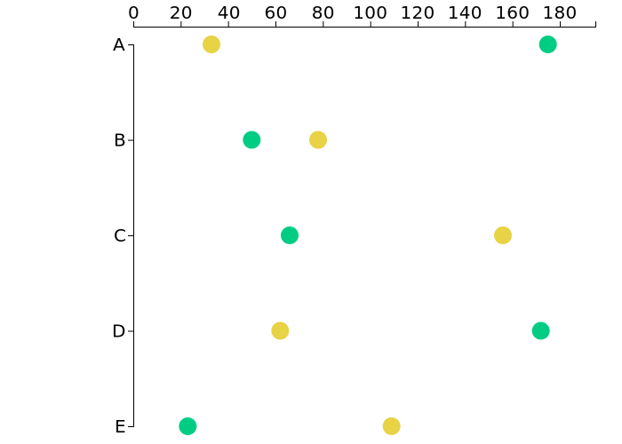

# How to make a lollipop chart in d3.js?

This is some dummy-code with dummy-data to produce a lollipop chart that looks like this:

## What is this good for?
- As a base template to produce proof of concept visuals in this format (and then export it e.g. via the NYTimes' [SVG Crowbar](https://nytimes.github.io/svg-crowbar/)) to then adapt it to the desired design with help of software like Adobe Illustrator

- As a rough starting point to turn it into an full-fledged interactive chart

## Options

**Scales**: In this example, the y-scale is categorical, the x-scale numerical. But basically it can be anything according to your (data's) needs.

**Categories**: In this example you have two categories that datapoints are color-coded by. You can choose to have more (make sure to adapt variables and scales in the javascript accordingly), and you can of course also choose to not color-code (e.g. if you only have one category anyways)

## Data structure

| Column 1: Y-Variable    			   | Column 2: Category (color)    			  | Column 3: datapoint (x-value)			     |
|--------------------------|--------------------------|--------------------------|
| This is where your different y-variables go,if you have more than one data point associated with one y-variable, enter each of them as a separate row | This is where the category your classes go that you want to use to color-code< in case you only have one data point for each y-variable this is probably not necessary |  This is where the actual datapoint goes that is associated with a certain y-variable & category combination |

## Real example
This repo contains only a dummy example. If you want to see an example with actual data, please check out [this repo](https://github.com/dw-data/quantify-europe_income-thresholds)

